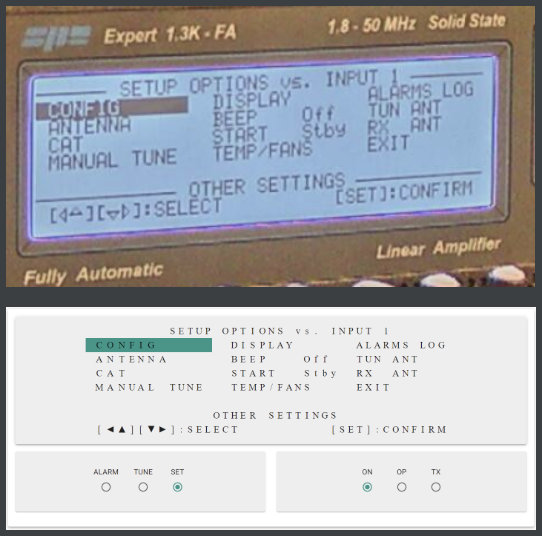

# FHNW Remote PA AddOn
This AddOn is an extension for the [FHNW Remote PA](https://github.com/HB9RYZ/SPE-Expert-Amplifier-Remote-Control). It enables the full functionality like **power on** the device and configure **display settings**.

## Setup
* download the latest [FHNW Remote PA .Jar File](https://github.com/HB9RYZ/SPE-Expert-Amplifier-Remote-Control/releases)
* open your .JAR file with WinRAR, 7-Zip or a similar tool
* you can find the AddOn in the folder **code**
* copy the file **ComPortExtendedDriver.java** to *BOOT-INF\classes\ch\fhnw\server\comPort* in your .Jar file
* copy the file **DisplayExtendedService.java** to *BOOT-INF\classes\ch\fhnw\server\service* in your .Jar file
* upload the new .JAR file to the server as described [here](https://github.com/HB9RYZ/SPE-Expert-Amplifier-Remote-Control/blob/master/src/SETUP.md)
